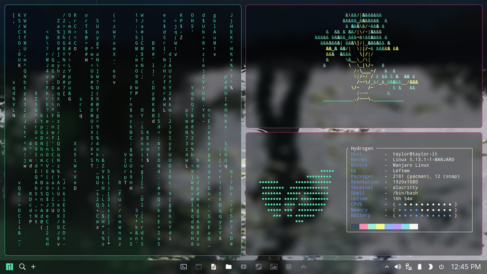
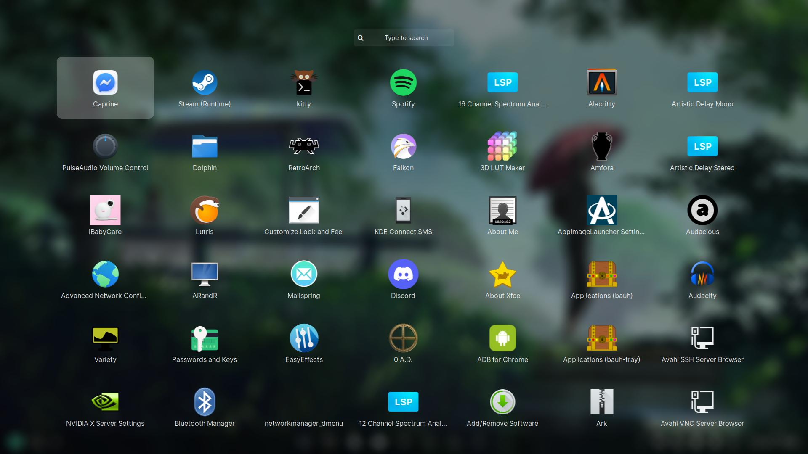
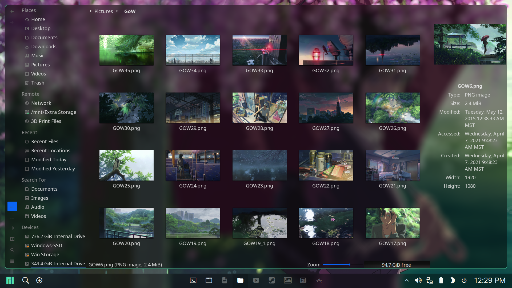

# Garden

## Packages

```
DE          : Manjaro
WM          : Leftwm
terminal    : Alacritty
bar         : Polybar
launcher    : Rofi
file manager: Dolphin
```

## Screenshot






## Dependencies

- [leftwm-git](https://github.com/leftwm/leftwm)
- [picom-jonaburg-git](https://github.com/jonaburg/picom)
- [polybar](https://github.com/polybar/polybar)
- [nerd-fonts-inter](https://github.com/rsms/inter)
- [rofi](https://github.com/davatorium/rofi)
- [dunst](https://github.com/dunst-project/dunst) (Optional for Notifications)
- [trayer](https://github.com/sargon/trayer-srg) (Optional, see Systray Configuration section)
- [feh](https://feh.finalrewind.org/)

## Installation via [leftwm-theme](https://github.com/leftwm/leftwm-theme)

If you have `leftwm-theme` installed, you can install this theme directly within LeftWM using the following commands:

```BASH
leftwm-theme update
leftwm-theme install Garden
leftwm-theme apply Garden
```

## Manual Installation

1. Install all required dependencies

2. cd into your Themes directory

```BASH
cd $HOME/.config/leftwm/themes
```

3. Clone the repository

```BASH
git clone https://github.com/taylor85345/leftwm-theme-garden.git Garden
```

4. Remove the symlink to your current theme if set

```BASH
rm current
```
5. Set this as your current theme

```BASH
ln -s Garden current
```

6. Restart your window manager

```Default shortcut
$MOD + Shift + r
```

## Configuration

  + Tag Bar
    
    The Tag Switcher in Polybar assigns icons based on your tag names as defined in your `$HOME/.config/leftwm/config.toml`. To match the icons in my screenshots, please copy the `tags =` line out of `misc/configs/leftwm/config.toml` into your config.toml

  + **Default Apps script**
    
    I've included the default_app script (assigned to the '+' in polybar) which assigns a program to each tag and opens whichever application is assigned to the currently focused tag. You can edit the script, or you can copy `misc/default_apps.sh` to `$HOME/.config/leftwm` and edit that file if you want your selections to survive leftwm-theme updates.
  
    By default, the script will launch the following

    ```BASH
    TERM=alacritty
    BROWSER=firefox
    DOC=libreoffice
    FILE=dolphin
    PLAYER=vlc
    GAME=steam
    PHOTO=gimp
    SANDBOX=virtualbox
    DEV="alacritty -e vim";
    ```

  + **Application Theming**
    
    For consistency, I use the following themes in GTK and QT apps:
    
    - QT5/Kvantum: [Inverse-dark](https://github.com/yeyushengfan258/Inverse-dark-kde)
    - GTK: [gtk-theme-breath](https://github.com/manjaro/artwork-breath-gtk)

    I highly recommend using QT5 applications with this theme, particularly those made for the KDE desktop environment, and applying the Inverse-dark theme via `qt5ct` and `kvantum-manager`.
  
  + **Fetch Script**
    
    If for some reason you want to use my fetch script, you will need to install [Macchina](https://github.com/Macchina-CLI/macchina) and copy my config folder ou of `misc/configs/macchina` to your `$HOME/.config/macchina`, and add the following to your .bashrc:

    ```BASH
    macchina
    ```

 + **Systray**
    
    If you find that the systray module "^" runs a little slow, there is an alternate option that requires `trayer` as a dependency. Just got to the `[module/systray]` section of `configs/polybar.config` in the theme folder and comment out the `click-left` and `click-right` lines, then uncomment the matching lines with the trayer command.
 
 + **Miscellaneous Configuration**
    For reference, I have included several miscellaneous files in the `misc/` folder which are not directly used by the theme, but are available to help with theming applications to match. I have included my config.toml for LeftWM, my config files for Alacritty/Kitty, the ASCII art from my `macchina` greeter, one or two scripts whose function is explained in the comments of the script, and my Wallpaper selection*.
    
## Credits

This theme is heavily based on the Linear theme for AwesomeWM by manilarome(https://github.com/manilarome/the-glorious-dotfiles), and I have borrowed several configs and scripts from that theme. The base LeftWM configs were modified from the Dracula Rounded theme by AethanFoot (https://github.com/AethanFoot/leftwm-theme-dracula-rounded). I've still got some mismatched Dracula configs hanging around, and I'll be removing/updating those in the near future.

*All provided wallpapers are clips taken from the film Garden of Words (2013) and are legally property of the owners of that film. I believe that my inclusion of these images constitutes Fair Use, but I am not an expert on copyright law and will gladly comply with any requests for the removal of these images.
